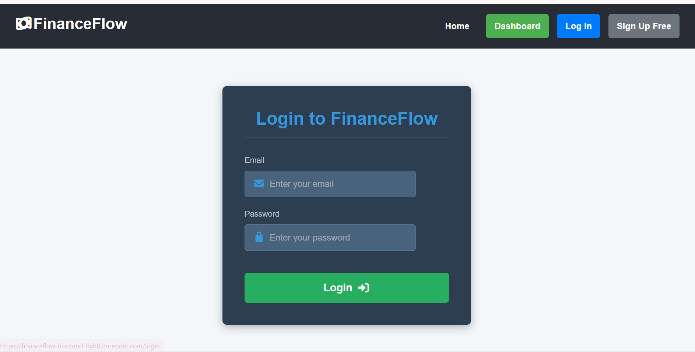
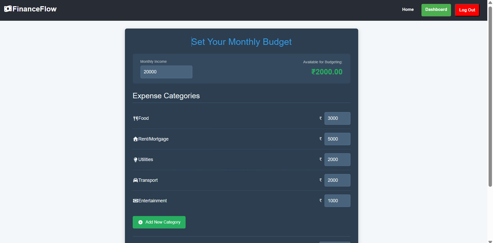
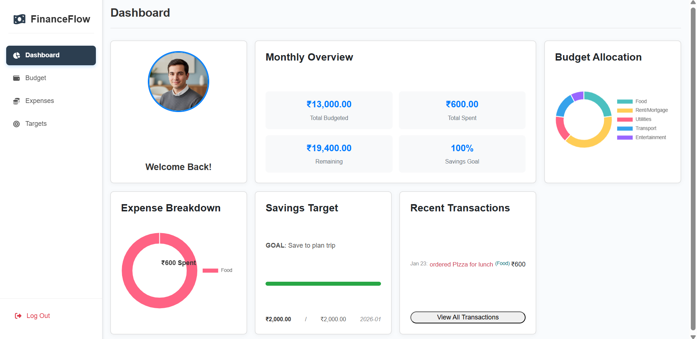
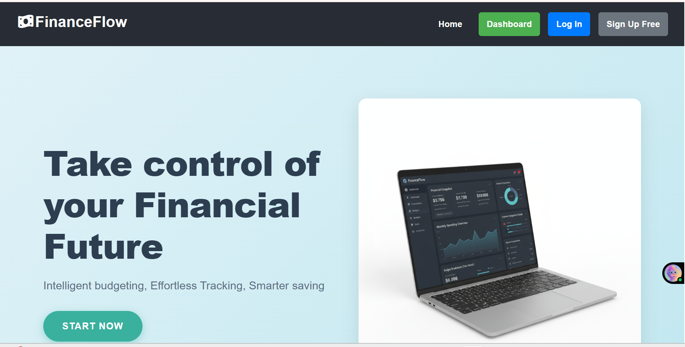

# FinanceFlow

FinanceFlow is a full-stack personal finance management application that helps users track expenses, plan monthly budgets, and analyze spendings & savings and financial goals through an interactive dashboard.

## Problem Statement

Many people lose track of their expenses and struggle to save money because they lack visibility into where their money is being spent.
FinanceFlow solves this problem by enforcing monthly budgeting and providing clear insights into spending behavior and progress towards financial goals.

## Features

- User authentication (Signup & Login)
- Monthly budget setup with category-wise allocation
- Expense tracking under different categories
- Financial goal (target) setting
- Dashboard visualization of spending and savings
- Secure user-specific data access

## Tech Stack

- Frontend: React.js
- Backend: Node.js, Express.js
- Database: MongoDB
- Authentication: JWT (JSON Web Token)
- Data Visualization: Chart.js

## Application Flow

1. User signs up and logs into the application
2. User sets a monthly budget by entering income and allocating category-wise limits
3. User adds daily expenses under different categories
4. User optionally sets a monthly savings goal (target)
5. Dashboard displays:
   - Total budget
   - Total expenses
   - Remaining balance
   - Goal progress
   - Transaction history

> Note: Users must set a monthly budget before adding expenses.  
> Without a budget, the dashboard prompts the user to set one.

## Database Models

- **User**: Stores user authentication details
- **Budget**: Stores monthly budget and category allocations
- **Expense**: Stores individual expense records
- **Target**: Stores monthly savings goals

All collections are linked using "userId" to ensure data isolation and security.

## Screenshots

### Login Page

### Budget Setup Page

### Dashboard

### UI

## Future Improvements

- Pagination for transaction history
- Export expenses as CSV or Excel
- Improved alerts and spending insights
- Enhanced UI/UX

---

## Conclusion

FinanceFlow is designed to encourage better financial habits by making users aware of their spending patterns and helping them plan savings effectively.
